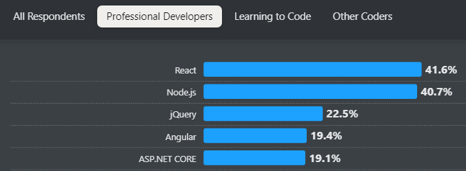
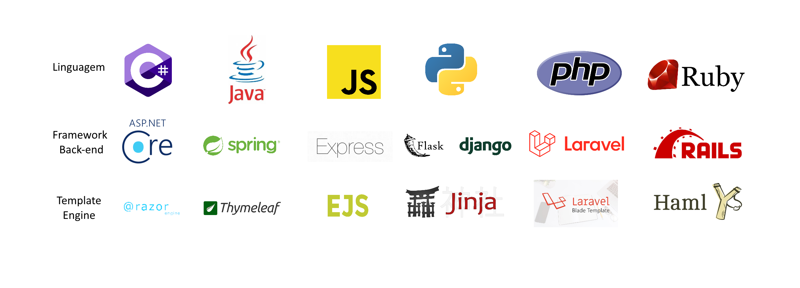

# Introdução ao Projeto Livraria

## O que será o projeto?
Faremos um projeto usando **ASP.NET Core MVC com Template Engine** de um sistema interno de uma livraria. Esse sistema será simplificado para fins de didática e para conciliar com o tempo da aula.

## O que é o ASP.NET Core
ASP.NET Core é o framework de .NET usado para desenvolvimento de aplicações Web, principalmente voltado ao back-end, é o framework de back-end mais usado do mercado segundo o StackOverflow Developer Survey de 2024.

## O que é ASP.NET Core MVC
ASP.NET Core MVC é uma das estruturas possíveis de criação de projetos dentro do ASP.NET Core, para entender ela precisamos entender o que é o padrão de arquitetura MVC.

## O que é MVC
Na área de desenvolvimento, é muito arriscado e pouco inteligente começar a programar um projeto sério sem seguir nenhum padrão de organização, por isso é essencial para programadores que entendam de padrões de arquitetura, ou seja, formas de organizar o funcionamento de um sistema. Existem vários padrões de projeto:

* Microsserviços
* Camadas
* Arquitetura Orientada a Serviços
* Pipes and Filters
* Monolito
* MVC

Não vou explicar todos esses aqui, somente o que iremos usar, o MVC.
MVC é um dos padrões de arquitetura mais usados, se não o mais usado da computação. Isso porque ele é extremamente simples de implementar e possibilita uma divisão das tarefas dentro da aplicação bem clara. MVC significa Model-View-Controller (Modelo-Visão-Controlador). Esses nomes dizem respeito aos papeis que a aplicação tem dentro dela:

## Por que usar o MVC?
Esse padrão de arquitetura, como dito antes, é um dos mais simples e um dos mais usados, além de ser ideal para aplicações menores como a nossa. Por fim, o Visual Studio, IDE feita para codar em .NET, possibilita diversas ferramentas auxiliares para criar projetos ASP.NET Core MVC de forma rápida.

## O que é Template Engine
Template Engine é uma forma de criar páginas HTML a partir do próprio back-end.

Essa forma de criar as Views (a letra V de MVC) é uma contraposição à forma que vocês viram de projetos, que usavam o conceito de Web Services:

Quando usamos Web Services, o Front-end e o Back-end ficam "separados" e nos comunicamos usando API, portanto o front-end pode ter frameworks como React, Angular, Next, etc. Já quando usamos Template Engine, o back-end, com a ajuda do Template Engine daquela linguagem, monta a página que será exibida no front-end. Nessas situações praticamente só programamos na linguagem do Back-end, no nosso caso C#.

Mas quais são os Template Engines principais das linguagens de back-end, e qual é o do C#?

Beleza, tem vários, mas vamos focar no ASP.NET Core e o Razor.

