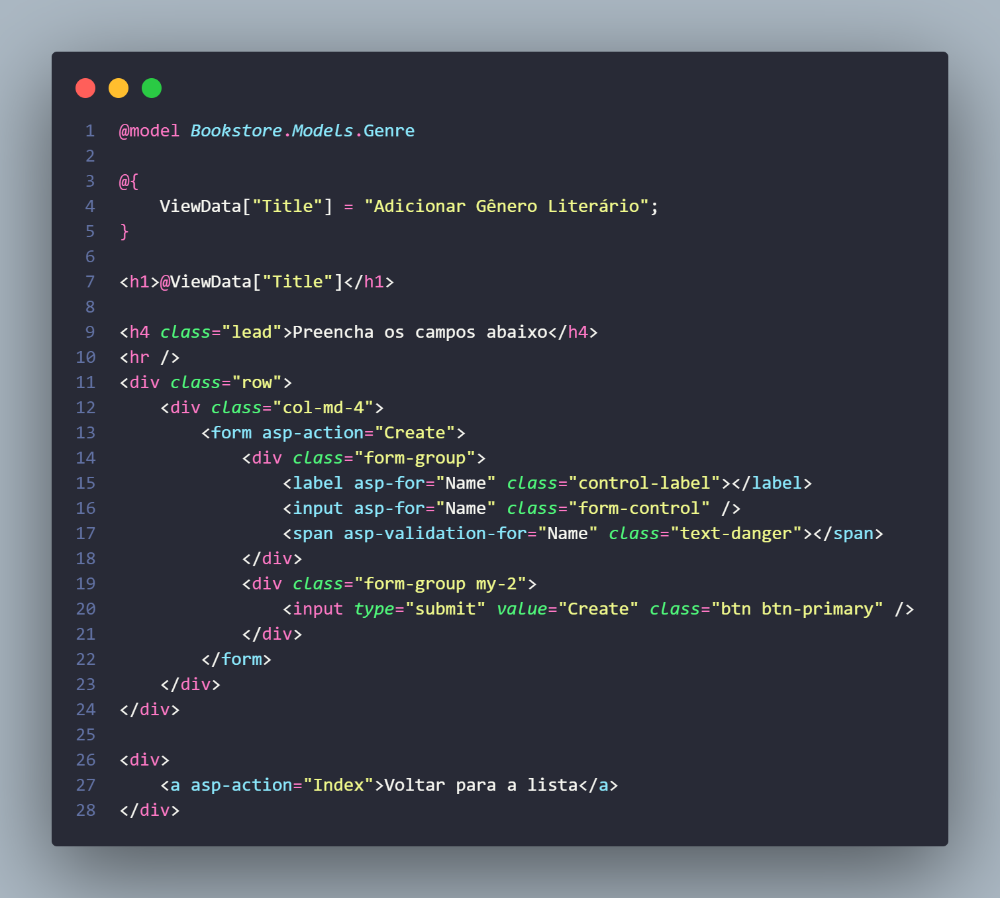
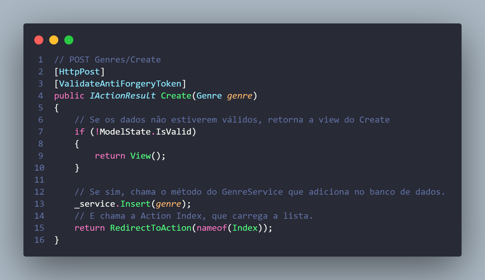

# POST do Genre

Agora que aprendemos a base da base sobre controllers, services, conexão com banco de dados, models, views, etc. A gente pode continuar o trabalho de forma um pouco mais eficiente sem precisar resgatar vários conceitos teóricos toda vez.

## Adicionar botão na barra de navegação para os Gêneros

Até agora toda vez que queremos acessar a aba de gêneros, temos que digitar na URL, para facilitar o trabalho, vamos adicionar um link na barra de navegação. Ela está localizada no arquivo `Views/Shared/_Layout.cshtml`, esse é o arquivo que exibe o HTML padrão de todas as páginas.

```html
<li class="nav-item">
    <a class="nav-link text-dark" asp-area="" asp-controller="Home" asp-action="Index">Início</a>
</li>
<li class="nav-item">
    <a class="nav-link text-dark" asp-area="" asp-controller="Genres" asp-action="Index">Gêneros Literários</a>
</li>
```

Note comparando com o seu código que havia mais um link aqui, o da página Privacy, como não vamos usar ela, pode apagar, assim como pode apagar a view `Privacy.cshtml` e o método `Privacy` no `HomeController`.


## Adicionando tela de "Adicionar Gênero Literário"
Para fazer essa tela, precisamos editar 3 coisas:
1 - GenresConroller
2 - GenreService
3 - Nova View

Vamos fazer cada uma delas.

### GenresController
No GenresController, precisamos criar a Action que carrega a tela de "Adicionar".
```c#
// GET: Genres/Create
public IActionResult Create()
{
    return View();
}
```

Essa parte não tem segrego, não tem nada de especial que precisamos passar aqui.

### View Create
Na pasta `Views/Genres` vamos adicionar uma nova view com o nome da Action, `Create.cshtml`.



No começo importamos o Genre pois todo o formulário de criação precisa usar os dados desse Model.

Nosso formulário possui uma `asp-action="Create"`, isso significa que quando ele for enviado, ela será executada, talvez você ache estranho, já que já temos essa Action e ela carrega essa tela, acontece que criaremos outra Action também chamada de Create e ela será do verbo POST, é ela que rola quando enviamos o formulário.

Nossa label e nosso input contém um `asp-for="Name"`, isso quer dizer que os dados colocados ali serão vinculados ao 
atributo Name da model Genre que importamos lá em cima.

Logo abaixo temos um span com o atributo `asp-validation-for="Name"`, esse é o span que mostra possíveis erros quando clicamos no botão de enviar o formulário sem ter preenchido tudo corretamente, inclusive ele já tá funcionando, se você clicar em enviar, ele mostra que o campo Name é obrigatório.

Isso acontece pois o campo Name é uma string e não colocamos um '?' depois dela para dizer que é nullable, logo ela é obrigatória, mas se quisermos podemos adicionar uma anotação explicita na Model para melhorar mais a leitura do código, bem como mudar a mensagem customizada.

```c#
[Required(ErrorMessage = "O campo {0} é obrigatório")]
```

Para essa validação funcionar corretamente, no final da view é preciso adicionar o seguinte código, ele permite que o JS no cliente faça a validação.
```c#
@section Scripts {
    @{
        await Html.RenderPartialAsync("_ValidationScriptsPartial");
    }
}
```

### Método POST para criar Genre

Agora que fizemos a tela, como citado, ao clicar em enviar o formulário, ele executa a Action Create cujo 
verbo é POST, precisamos criar ela:



Note algumas coisas:

1. Para dizer que o método é POST, colocamos uma anotação `[HttpPost]`.
2. Para evitar um tipo de ataque chamado de Cross-site Request Forgery, adicionamos a anotação `[ValidateAntiForgeryToken]`, esse ataque consiste de o usuário se autenticar no seu sistema, visitar um site malicioso que rouba a chave de autenticação e usar isso para enviar requisições para o seu sistema, podendo roubar, inserir, apagar ou editar dados.
3. Essa Action não faz o processo de adicionar o dado no banco, ela chama o Service que faz isso, portanto precisamos criar um método chamado Insert no GenreService, que recebe um Genre.

### Inserindo Genre no banco pelo Service
Aqui o processo é bem simples, basta fazer o seguinte código:

```c#
// POST: Genres/Create
public void Insert(Genre genre)
{
    _context.Add(genre);
    _context.SaveChanges();
}
```
O método pega o gênero passado e adicionar ele no banco através do _context.Add, depois ele salva as alterações, mais simples impossível!
