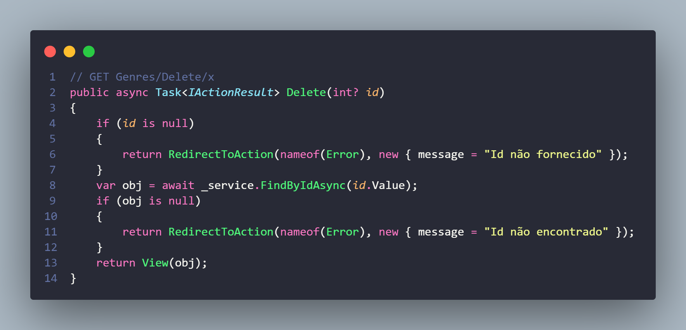
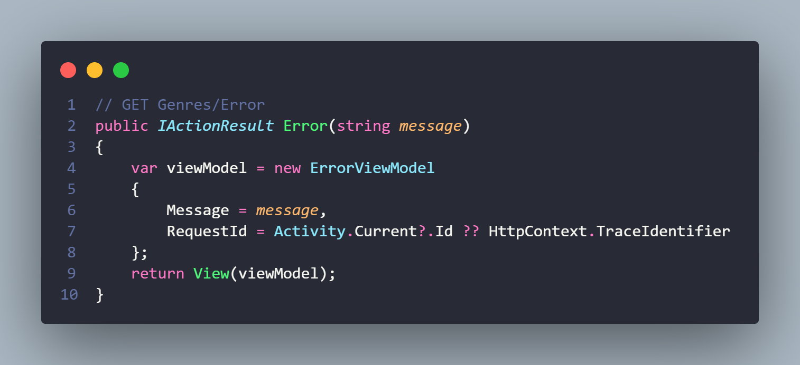
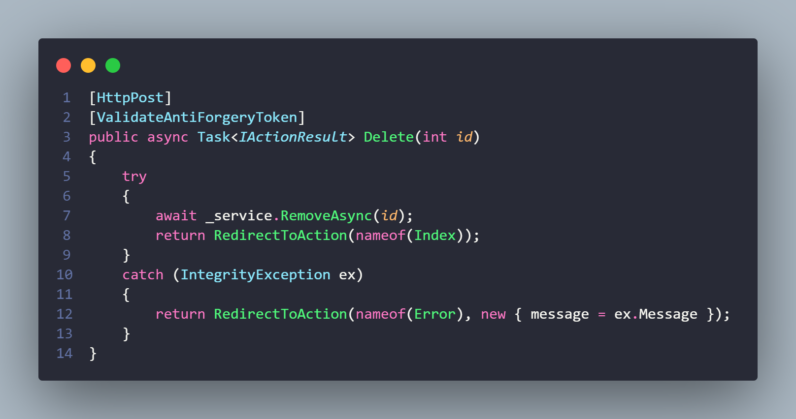
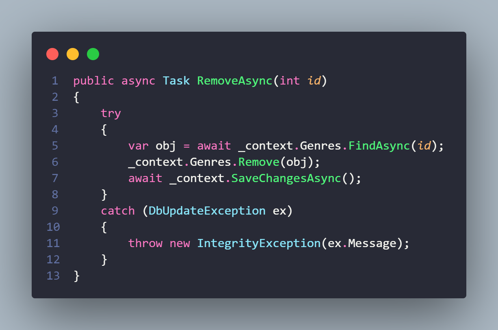
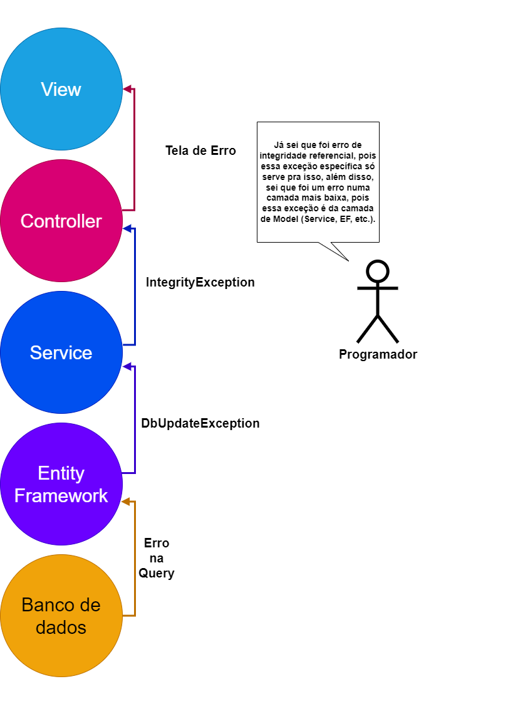

# Delete do Genre


## Adicionar tela de Apagar

Agora vamos poder apagar um gênero, para isso, precisamos repetir o processo:

1 - Criar Action no Controller para carregar a tela de excluir (para confirmação).

2 - Criar View correspondente.

3 - Criar Action no Controller que de fato manda apagar o dado.

4 - Criar método no Service que faz o apagamento no banco.

Mas antes disso, precisamos pensar em um detalhe importante, operações assíncronas.

Não preciso explicar pra vocês novamente o que são operações assíncronas, mas até então todas que fizemos não eram, portanto, vamos adaptar isso a partir de agora.

### Refatorando operações assíncronas

* Todos os métodos do GenreService mudarão de `Nome` para `NomeAsync`.
* Todos os métodos tanto do Service quanto do Controller terão a palavra async no início.
* Todos os métodos do Service e do Controller terão como tipo do retorno a mudança de `Retorno` para `Task<Retorno>`, se era `void` fica apenas `Task`.

Exemplo de mudança:

Método POST de criar gênero antes:

`public  IActionResult Create(Genre genre)`

E depois:

`public async Task<IActionResult> Create(Genre genre)`

Além disso, em todos os métodos do Controller que estão dando erro (Create e Index), basta trocar o método do Service que está sendo chamado pelo nome novo e adicionar um await antes da chamada, exemplo:

Dentro do método Create (POST), na chamada para o Service adicionar o novo gênero no banco:

Antes:

`_service.Insert(genre);`

Depois:

`await _service.InsertAsync(genre);`

Já no Service, a maior as consultas ao banco de dados terão a adição de um await antes e de um Async no nome:

```c#
// GET: Genres
public async Task<List<Genre>> FindAllAsync()
{
    return await _context.Genres.ToListAsync();
}

// POST: Genres/Create
public async Task InsertAsync(Genre genre)
{
    _context.Add(genre);
    await _context.SaveChangesAsync();
}
```

Pronto, agora podemos continuar fazendo o processo de apagar um Genre, lembrando dos passos necessários:

1 - Criar Action no Controller para carregar a tela de excluir (para confirmação).

2 - Criar View correspondente.

3 - Criar Action no Controller que de fato manda apagar o dado.

4 - Criar método no Service que faz o apagamento no banco.

### 1 - Criando Action da tela de Delete

Como essa primeira Action é na verdade para carregar a tela de "Deseja excluir mesmo?", ela vai ser uma Action do verbo GET.



Note a checagem que está sendo feita.

Primeiro a gente confere se o id passado existe, se não existir, o usuário é redirecionado para uma Action de Erro (que a gente vai criar) com a mensagem "id não fornecido"). Agora, caso o cara tenha passado um Id mas esse Id não bate com nenhum Genre, então a gente vai pra mesma Action, mas com outra mensagem de erro, essa Action vai carregar uma tela de erro com a mensagem que a gente passar.

Caso dê tudo certo, ele carrega a view de Delete passando o objeto que teoricamente vai ser apagado.

Primeiro vamos criar a Action, refatorar a tela de erro e também a ViewModel de erro, sim vocês já vão entender.

### 1.1 - Refatorando Action, ViewModel e Tela de Erro

Como a ausência de Id ou o Id errado redireciona a gente pra uma Action chamada Error:

```c#
return RedirectToAction(nameof(Error), new { message = "Id não fornecido" });
```

Então precisamos criar ela, vou criar lá no final do Controller.


Antes de explicar ela, precisamos entender o que é uma View Model...

### 1.1.1 - O que é uma View Model

Uma view model é um tipo de classe que serve pra gente passar dados do Controller pra View, ela não representa uma tabela do banco de dados igual a Model, mas quebra um galho em algumas situações, principalmente quando precisamos passar mais de uma informação, exemplo:

Você quer exibir numa tela todos os livros e vendedores, você vai ter que passar dois Models do Controller pra View, a questão é que ela só aceita um (com aquele @model) no começo da tela, então você faz o que? Cria um Model de mentira composto pelos livros e pelos vendedores e manda esse model pra view, a gente vai enviar uma coisa só, mas ela é feita de duas ou mais outras.

A questão é que nesse caso específico, a gente quer enviar pra view de erro uma mensagem e também o Id exato da requisição que deu erro para fins de debug (no nosso caso a gente nem vai usar, mas é algo comum, usado para buscar através desse código em que trecho que ocorreu um erro).

### 1.1.2 - Mexendo na viewModel

Tendo entendido o que é uma ViewModel, podemos então compreender o código melhor, a gente está instanciando uma ViewModel, passando a mensagem que escrevemos na outra Action e também buscando o Id da requisição, isso é feito através daquele código todo depois do `RequestId =`.

Agora precisamos arrumar a View Model em si, se vocês tiverem movido ela de local lá no começo, ela vai estar na pasta `Models/ViewModels`, se não, ela vai estar só na `Models`.

Nela a gente vai adicionar a seguinte propriedade:

```c#
public string? Message { get; set; }
```

Pois ela estava configurada inicialmente para receber apenas o Id e tem uma propriedade derivada (a com arrow function), uma propriedade derivada é uma propriedade somente para leitura cujo valor vem de uma expressão, nesse caso essa prop serve só para verificar se tem um Id da request ou não de forma elegante.

### 1.1.3 - Mexendo na view de Erro

Agora precisamos ir até a pasta `Views/Shared/Error.cshtml` e refatorar o código para isso:


A gente tirou todo o código de aviso de desenvolvimento, mandou exibir a mensagem e traduziu algumas coisas pra português, e agora é isso, terminamos de consertar as mensagens de erro.

## 2 - Criar view que mostra dados do Genre e pergunta se quer mesmo apagar.

Vamos primeiro focar no que estavamos fazendo antes da mensagem de erro: 


Depois de não acontecer erro nenhum, a gente vai pra View da Action DELETE, inclusive passamos o objeto nela pra exibir os dados dele na tela.


Nessa view a gente exibe os dados do Genre (no caso só o nome dele) e pergunta se quer mesmo apagar.

A parte do botão de apagar fica dentro de um formulário, se esse formulário for submitado, é executada a action Delete (no caso, a que realmente vai apagar os dados, não a que só carrega a página), passamos um input oculto dentro desse form só pra ele conter o Id necessário pra action conseguir apagar o cara certo.

## 3 - Criar Action no Controller que realmente manda apagar o Genre

No passo 1 criamos uma action que carrega a tela chamada Delete, agora criaremos outra que também se chama Delete, mas essa é a que roda depois do usuário clicar no botão de Apagar.

Talvez vocês se perguntem como o ASP.NET Core diferencia as duas Actions se as duas se chamarão `Delete`, ele diferencia pois as duas são de verbos HTTP diferentes, a primeira era do tipo GET, a segunda talvez vocês pensem que é do tipo DELETE, certo? 

Bom, é uma interpretação plausível, inclusive possível de ser feita e em termos de semântica, é a melhor, no nosso caso, para fazer dessa forma teríamos que escrever um bocado de JS misturado com C# para adaptar a requisição para o tipo DELETE, pois a requisição é enviada ao clicar no botão dentro do formulário e enviar um formulário é algo que só pode ser feito usando uma requisição do tipo POST nessa nossa estrutura de MVC, logo, a recomendação mais comum (inclusive na documentação oficial) é fazer a Action que de fato apaga os dados ser na verdade do tipo POST (inclusive quando formos implementar a aba de editar, faremos a mesma coisa).

Nosso código dessa Action ficará assim:



Repare, ele tenta executar o método RemoveAsync do _service, precisamos criar esse método no Service para executar o apagamento em si.

## 4 - Método de apagar do Service



Esse método pega o Id, busca o objeto correspondente, tenta remover e salvar as alterações. 

Caso ele consiga, tudo certo.

Caso não consiga, ele vai lançar uma exceção especial, uma exceção de integridade, o que isso quer dizer?

A gente já verificou antes de chamar esse cara se o Genre existe, logo, se ocorreu um erro aqui não foi por isso, mas sim por integridade referencial, a gente está tentando apagar um cara que tem outras entidades vinculadas (nosso Genre terá Books vinculados), para evitar esse erro, lançamos uma exceção aqui.

Inclusive lá na Action a gente pegou essa exceção e mostrou a tela de erro, mas eu ignorei isso de propósito, olha o catch:


A questão é que essa exceção não existe ainda, a gente vai criar nossa própria exceção personalizada, vai por mim não é muito difícil.

## 5 - Passo extra, criando exceção personalizada
Na pasta `Services`, criaremos outra pasta chamada `Exceptions` e dentro dela uma classe comum chamada `IntegrityException`, o código dela será só isso:

```c#
public class IntegrityException : ApplicationException
{
    public IntegrityException(string? message) : base(message)
    {
    }
}
```

Ela herda da ApplicationException e tem um construtor que leva pra mãe uma mensagem.

Ok, ok, criamos ela, mas pra que? Se formos ver, no Service a gente capturou uma exceção do tipo DbUpdateException e lançou uma de outro tipo, isso não é só mais trabalho atoa? Bom, na verdade não.

Uma boa prática de código é manter cada camada da aplicação bem separada e bem independente, de forma que até os erros lançados sejam diferentes pra que a gente consiga diferenciar melhor.



Agora sim tá tudo certo com o apagamento de dados, lembrando que pode parecer extremamente complicado isso que estamos fazendo, mas algumas coisas como as exceções personalizadas ou a tela de erro só são feitas uma vez, além de que o código dos controllers do Livro, Vendedor ou Venda também são todos meio parecidos com uma outra variação, esse primeiro é mais difícil.
