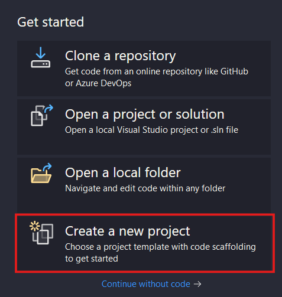
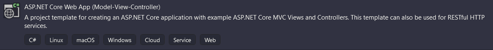
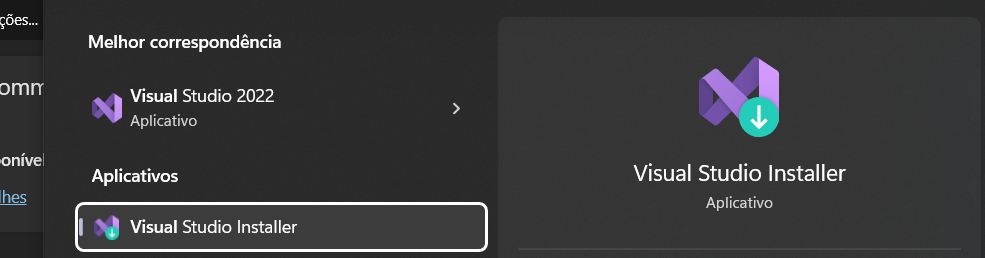
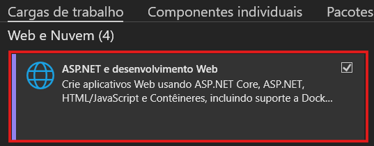

## Criando o Projeto ASP.NET Core MVC
Antes de começar, é importante lembrar que é fortemente recomendado o uso da IDE Visual Studio 2022


Caso você não utilize o sistema operacional Windows ou use mas tenha um PC fraco, é possível usar o VS Code:


A questão é que o Visual Studio 2022 é muito mais preparado para programar em C#. Caso ainda assim decida codar no VS Code, para criar o projeto digite no terminal o comando:
```shell
dotnet new mvc
```
Caso opte por usar o Visual Studio 2022, abra-o e selecione essa opção:

Depois, procure essa opção de projeto:

Caso ela não apareceça, é preciso verificar se você tem instalado o pacote de desenvolvimento de aplicações Web no seu computador, abra o **Visual Studio Installer**:

Clique em modificar no Visual Studio:

Selecione essa opção e clique em **Instalar durante o download**:


* Depois disso, aquela opção de projeto aparecerá, selecione-a.

* Nomeie o projeto, escolha o local onde ele ficará no seu PC.

* Selecione a versão .NET 8.0 (Long Term Support) e deixe o restante das coisas sem mexer, finalize apertando em Criar (Create).