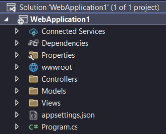

# Estrutura de um projeto ASP.NET Core MVC

A estrutura geral do projeto quando criamos ele é essa:

Vamos entender cada um dos itens dela:

* **Solution:** É o arquivo que gerencia a solução (a aplicação inteira essencialmente), uma solução é formada de um ou mais projetos. No explorador de arquivos vocês verão um arquivo .sln. **Não mexemos nesse arquivo.**

* **WebApplication1:** É o nome do projeto, aqui aparecerá o projeto com o nome que vocês deram ao criá-lo, ele é um arquivo com o formato .csproj. Nesse arquivo **podemos até mexer em algumas coisas** para configurar o projeto, **mas geralmente não.**

* **Connected Services:** Essa opção é única do Visual Studio, é basicamente um atalho para nos conectarmos com outros serviços que podemos usar em conjunto na nossa aplicação. Lembrando que essa forma de se conectar facilita bastante mas não é obrigatória, essas conexões são possíveis só com código. No nosso projeto, não usaremos essa opção.

* **Dependencies:** É mais um atalho, dessa vez não para conexão com serviços externos, mas para controle das dependências e pacotes do projeto que instalamos usando o gerenciador de pacote NuGet ou de outra forma.

* **Properties:** Nessa pasta fica o arquivo **launchSettings.json**, esse arquivo define algumas configurações de execução do projeto, como em que URL ele irá rodar.

* **wwwroot:** É a pasta onde ficam arquivos estáticos carregados pelo servidor web, tipo a pasta public do node.js:
    
    * CSS e JS fixos que serão usados no site.
    * Arquivos de mídia estáticos, como imagens.
    * Bibliotecas auxiliares, o projeto inclusive já vem com Bootstrap e JQuery instalados automaticamente.

* **Controllers:** É nessa pasta que fica o C do MVC, os controllers que cuidam de receber as requisições, enviar para quem deve, receber a resposta e enviar de volta.

* **Models:** É onde fica o M do MVC, os models são as representações das entidades do sistema. Aqui também ficam as ViewModels, uma espécie de letra a mais no MVC que usaremos no futuro.

* **Views:** Finalmente, o V do MVC, é aqui onde ficam as páginas "HTML" do site, ou melhor, as páginas HTMLCS, a extensão de arquivos do Razor, que é o Template Engine que usamos para poder misturar HTML e C#.

* **appsetings.json:** É o principal arquivo de configuração do projeto, nele colocamos, por exemplo, a conexão com o banco de dados do MySQL.

* **Program.cs:** Talvez a única coisa familiar para vocês nesse primeiro momento, essa é a classe principal dos projetos de console e continua sendo agora no ASP.NET Core MVC, ela é o Entrypoint da aplicação, ou seja, o código começa a rodar por aqui, essa classe terá um papel bem especial no nosso projeto, ela que cuidará de diversas configurações mais dinâmicas da aplicação.
