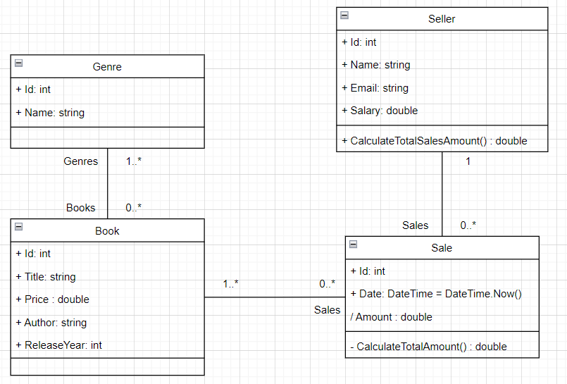

# Como será nosso projeto?

Antes de começarmos a programar, precisamos entender o que faremos, certo?

## Do que se trata nossa aplicação?

Como comentado brevemente no primeiro arquivo, faremos um projeto simplificado de um sistema interno de uma livraria. Nesse projeto poderemos cadastrar vendedores, livros e vendas. Com cadastrar me refiro a criar, ver, editar ou remover. Essas são as quatro operações básicas dos 4 verbos HTTP que aprendemos antes (POST, GET, PUT e DELETE) e também das quatro operações do CRUD (Create, Read, Update, Delete), que são as quatro operações feitas no banco de dados.

## Diagrama de classe

Lembrando que esse é o diagrama de classe só das entidades principais do projeto, a quantidade total de classes é muito maior.
