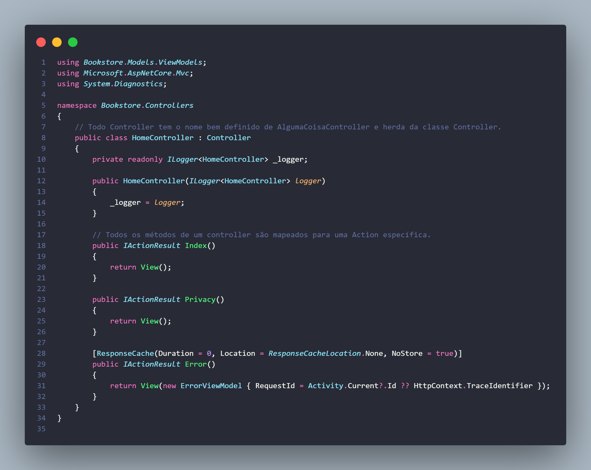
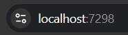
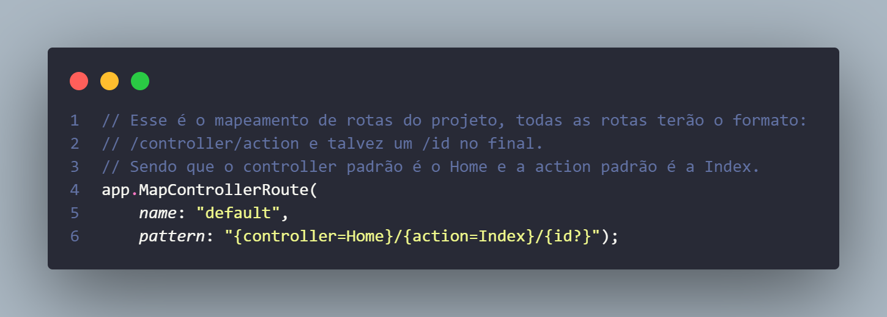
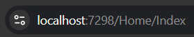
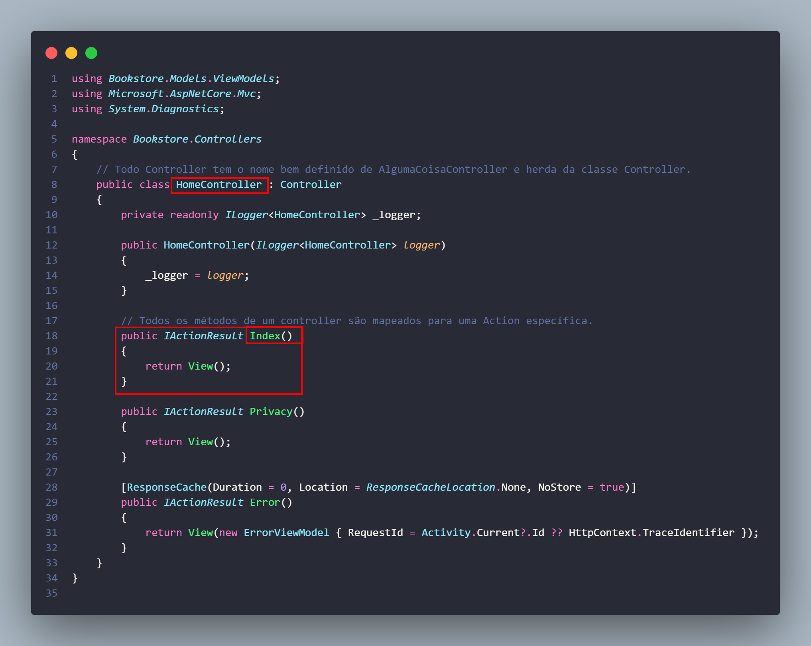
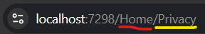
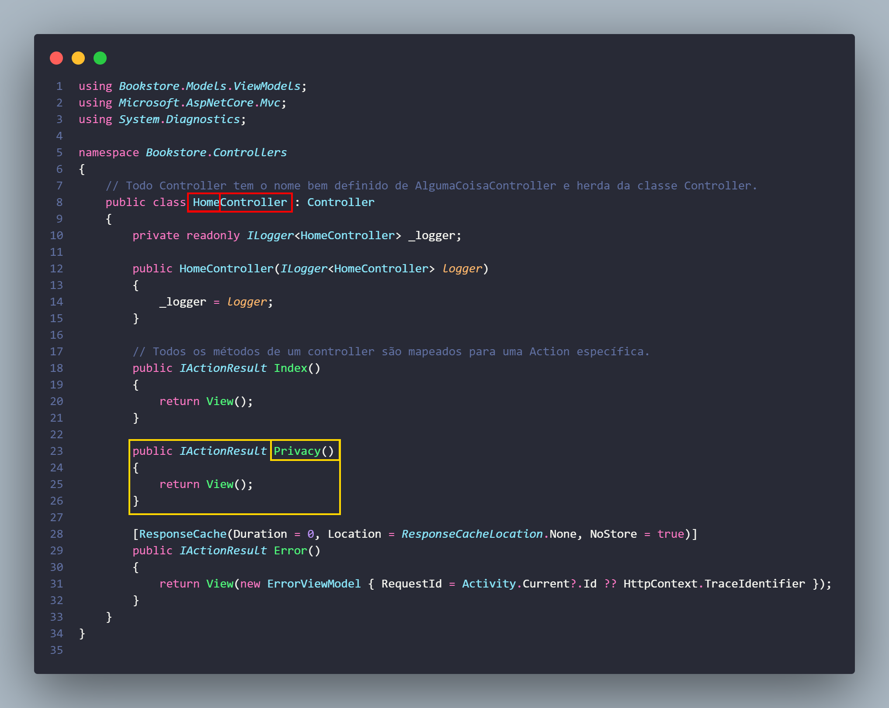
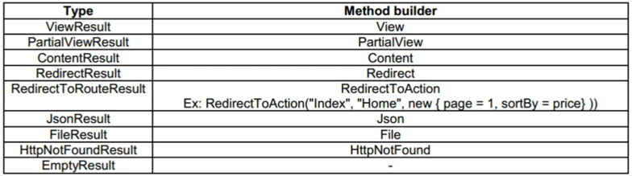

# Como é a estrutura de um controller



### Meio abstrato, né?

Isso porque temos que entender o seguinte.

Quando acessamos nosso site pela primeira vez, ele aparece nessa URL:


Já veio definido no nosso Program.cs que quando a gente entra no site por essa URL sem nada depois da porta (:7298), o Controller que cuida disso é o HomeController:


Não só isso, foi definido também que deve ser executada a Action chamada Index, o que isso quer dizer?
As Actions são basicamente os diferentes métodos que a gente tem dentro de um controller, cada uma cuida de uma URL. Por ter sido definido que a URL "vazia" é a Action chamada Index do Controller chamado Home, entrar na URL base ou nessa aqui da no mesmo:


E quem cuida do que aparece nessa tela é justamente o método Index do controller Home:



Se eu digitasse na URL /Home/Privacy, quem cuida é o método Privacy do Controller Home:





É importante entender isso pois aí entendemos o papel do Controller aqui: armazenar os métodos (Actions) responsáveis por cada uma das que o usuário faz com o sistema.

## O que as Actions estão fazendo?
Agora que entendemos que cada método do Controller é uma Action e que dependendo da URL elas são automaticamente chamadas, precisamos entender o que elas estão fazendo, afinal tanto a Index quanto a Privacy que citei de exemplo estão só dizendo:
```c#
return View();
```
O que isso quer dizer, afinal?

Esse `View()` é o que chamamos de _method builder_, em essência, o method builder tem como finalidade retornar uma View para ela ser exibida.

```markdown
> Lembrando que a View é a parte do sistema MVC que o usuário interage, ela é essencialmente a tela do site, logo, o método View() retornou uma tela, mas qual?
```
Para entender qual tela ele retornou, precisamos dar uma olhada na pasta `Views` do projeto, mas vamos fazer isso no próximo documento, antes disso, vamos comentar rapidinho sobre o tipo do retorno desse método, `IActionResult`.

## IActionResult
Uma dica sobre C# é ficar de olho na letra I no começo do nome da "classe", quando a classe se chama IAlgumaCoisa na verdade ela é uma interface, interfaces são representações de "contratos" que uma classe deve ter caso implemente ela. No nosso caso, ao passarmos que o retorno desse método é IActionResult, estamos dizendo que pode ser que o método retorne qualquer um dos tipos à esquerda dessa tabela:
