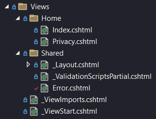
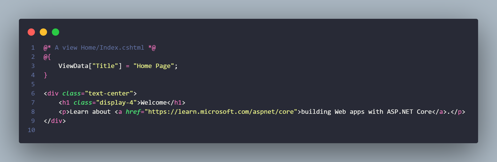
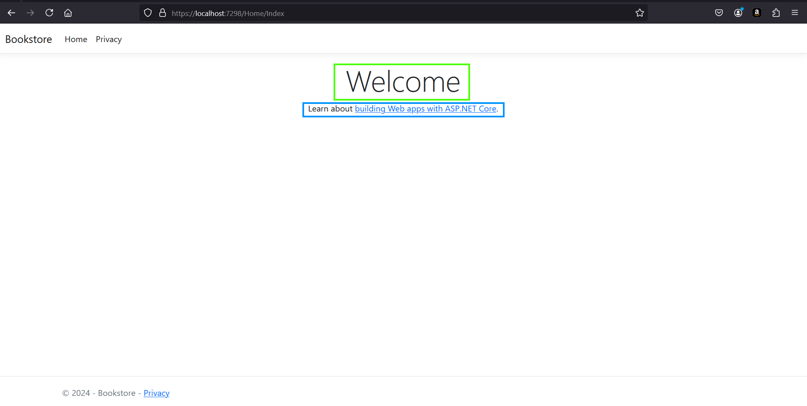
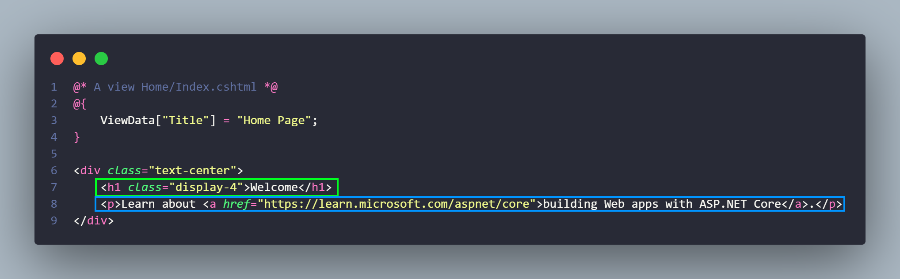
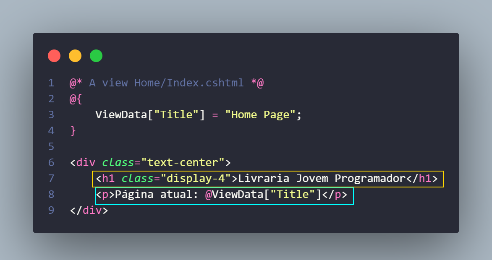
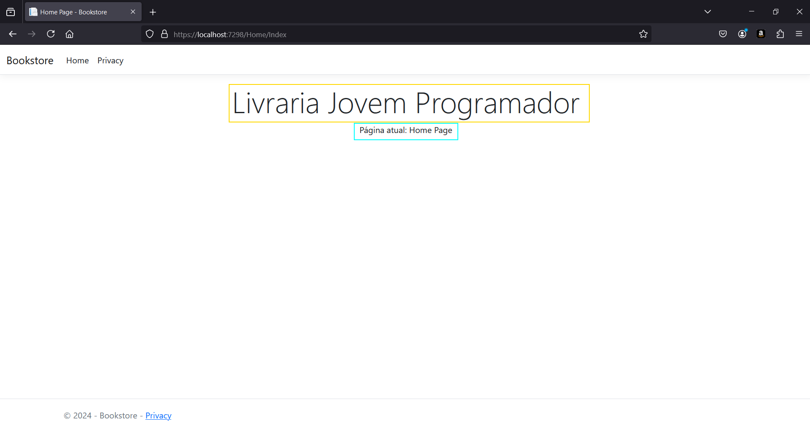

# Primeiro contato com as Views
No final do documento anterior falamos que cada uma das Actions do Controller retorna uma View específica, mas qual?

Para entendermos isso, precisamos ver a pasta de `Views` do projeto:

Como dá pra notar, dentro dessa pasta, temos outra chamada Home e dentro dela dois arquivos chamados Index e Privacy, justamente o nome do Controller e de suas duas Actions respectivamente, isso porque o ASP.NET Core é fortemente baseado em padrões de nomenclatura, ele sabe que, na Action Index do Controller Home, a view que é retornada é justamente essa Index.cshtml.

Todo esse processo de vincular uma URL a um Controller e suas Actions e cada uma delas retornar uma View específica é chamado de **Natural Templates**, nem todo Template Engine adota esse modo de funcionamento, mas voltando pro código, por que as views tem essa extensão .cshtml?

## O que é esse cshtml?
Ok, entendemos o vínculo que o Controller e suas Actions tem com as respectivas Views, mas essas Views não são arquivos de C#, certo? Arquivos de C# são da extensão .cs, esses são da extensão .cshtml.

Na verdade as Views são arquivos de HTML dinâmicos, lembram do JSX do React, aquele HTML que ficava dentro do JavaScript e podíamos misturar com JavaScript? Então, agora temos um HTML misturado com C#, por isso a extensão cs (CSharp) e html (do HTML).

## Como é uma view por dentro?

Como dá pra ver, é uma combinação bem exótica, podemos notar o HTML que conhecemos na parte de baixo e também um código estranho em cima, esse código usando @, a primeira linha é um comentário, o outro @ com um bloco de chaves é uma marcação do Razor, aquele Template Engine que vimos na introdução. Esse bloco serve para demarcar que ali dentro temos C#, no caso, estamos "criando uma variável" chamada Title e colocando dentro dela o valor "Home Page", essa criação da "variável" é feita na verdade criando um dicionário chamado ViewData e colocando o valor "Home Page" na chave "Title" desse dicionário.

## Alterando a View
Primeiramente precisamos entender que essa view está exibindo "exatamente" o que está aparecendo na tela quando acessamos a URL vinculada a ela:

Logo, podemos alterar como quisermos o código dela, exemplo:

Mas isso foi só um teste, faremos outras alterações aqui e em outras views no futuro, agora vamos para o que realmente importa.