# Implementando a classe Genre (Gênero)

No nosso sistema, teremos a possibilidade de buscar livros pelo gênero literário deles, é possível fazer isso de mais de uma forma, mas faremos criando uma entidade focada apenas no gênero, um objeto Gênero poderá ter vários objetos Livro.

Quando vamos criar uma classe Gênero, na verdade temos que criar pelo menos um Model, um Controller e uma View para cada Action do Controller. Primeiro criaremos o Model:
# Model
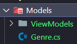

O model é uma classe comum, criamos os atributos dela (propriedades) e os construtores:
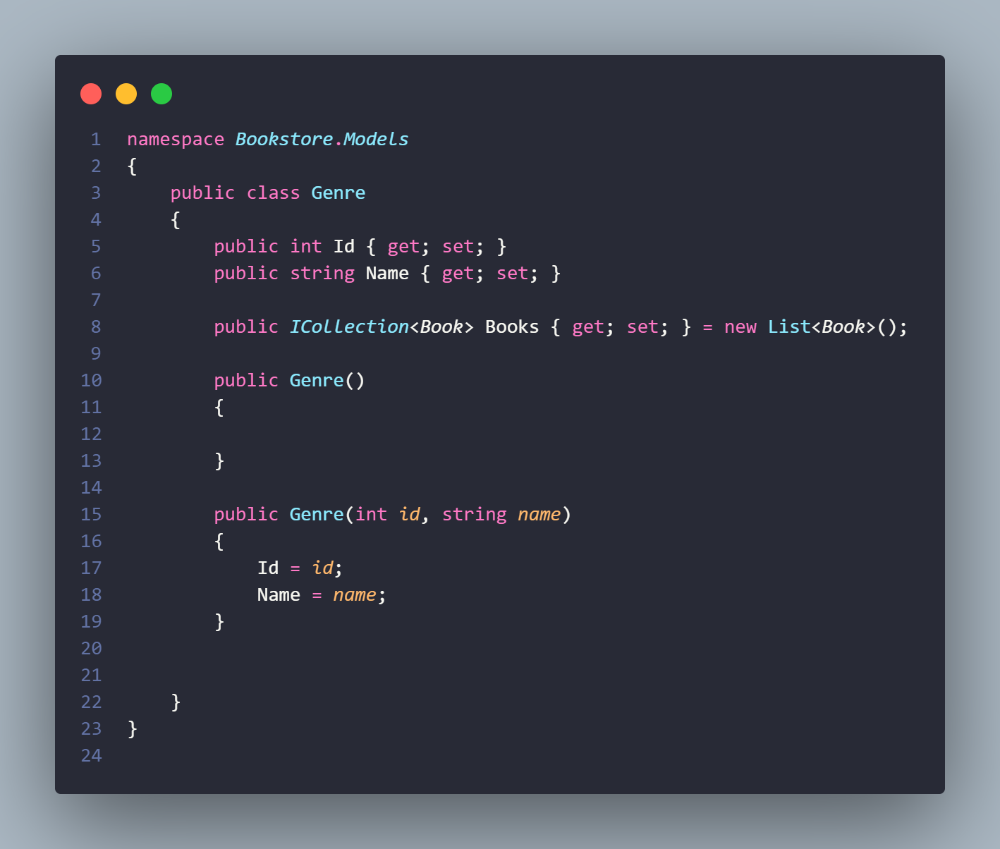

## Upcasting
Porém notem três coisas nesse código:
1.  A coleção de livros que o gênero tem na verdade é do tipo `ICollection<Book>` e não `List<Book>` como vocês estão acostumados, isso porque ICollection<T> é uma interface genérica para coleções, quando dizemos que o atributo é desse tipo estamos dizendo que ele pode ser quase qualquer tipo de coleção que implementa essa interface.
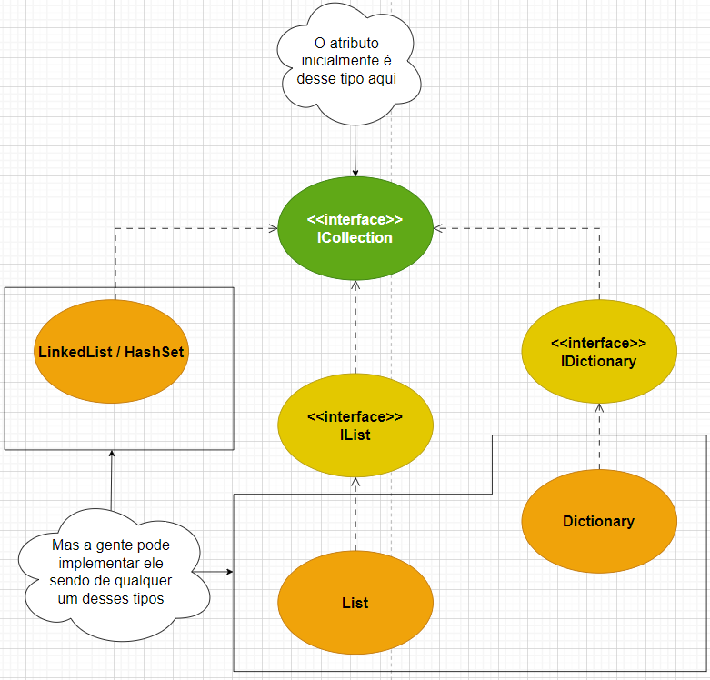
2. Instanciamos essa coleção como uma nova List<Book>, esse processo de criarmos uma variável de um tipo "pai" e instanciarmos nela um tipo "filho" é o processo chamado de **upcasting**, uma das técnicas do polimorfismo, pilar da POO.
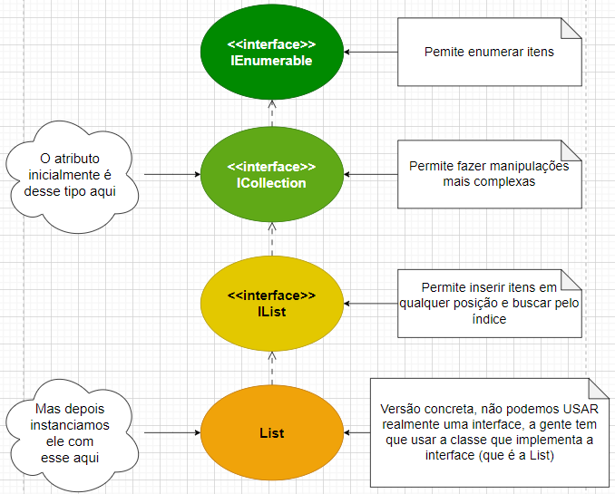
3. Esse atributo não precisa ir no construtor, pois ele sempre começa instanciado.

Provavelmente ficou claro para vocês que é interessante dizer que o atributo é de um tipo mais genérico para permitir que vários tipos de coleção possam ser armazenados nele, a questão é que de cara já instanciamos uma lista, é como se estivessemos privando esse atributo de receber outras coleções, certo?

Errado! Na verdade a gente consegue mudar o tipo dessa coleção se precisar, desde que usemos outro tipo que também implementa a interface ICollection.  
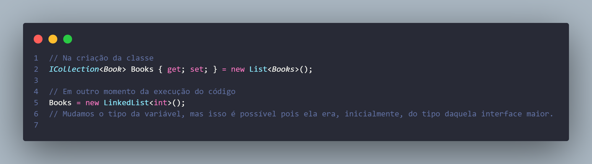
É interessante entender esse funcionamento para entendermos bem o motivo pelo qual escrevemos determinadas linhas de código, ao invés de só copiar.

Aliás, se notarem, tá dando erro na palavra Book dentro da ICollection e da List, isso porque ainda não existe uma classe Book, se você quiser, pode criar a classe Book agora, mas daqui a pouco teremos que apagar ela, isso porque só fará sentido implementar essa classe se a gente já colocar o código todo dela, por enquanto não faremos isso, minha recomendação é comentar a linha de código que contém o atributo Books, futuramente removeremos o comentário e finalizaremos essa parte.

# Controller
Agora que criamos a model do gênero, vamos criar o controller, a gente até pode criar ele como uma classe comum, mas é mais simples selecionar a opção de criar um controller no Visual Studio:
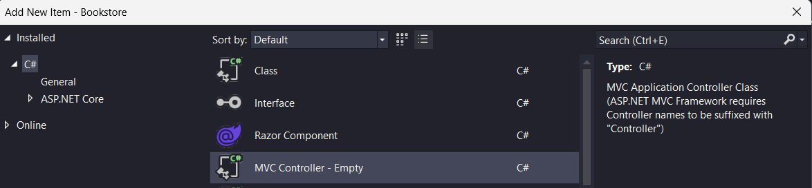

Essa classe tem que ter o nome exatamente dessa forma:
`GenresController`.
Isso porque no ASP.NET Core, o nome das classes e dos métodos é usado pelo intrepretador para entender do que estamos falando, se damos o nome GenresController, o código sabe que estamos falando do controlador do gênero, no caso, usamos a palavra no plural simplesmente para que apareça assim na URL, o que faz mais sentido, imaginem que queremos ver quais são os gêneros cadastrados, entramos nessa tela do site, ela fica na URL: `/Genres/Index`, gêneros, não gênero, pois aparece mais de um.

Após criarmos o controller, ele aparecerá assim:
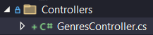
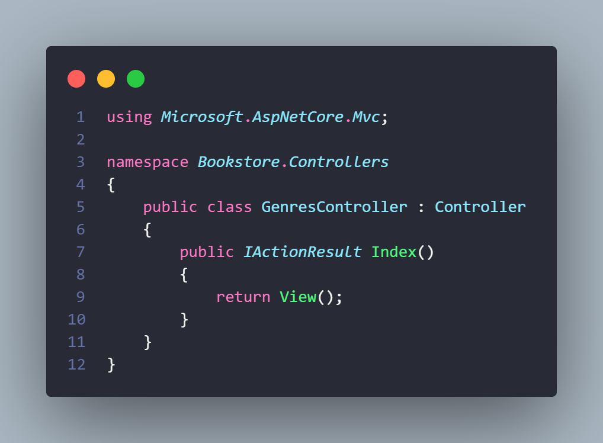

Em resumo, nosso Controller já vem com a primeira Action implementada, a Action Index. Ou seja, agora nosso controlador já vem com a possibilidade de retornar a tela de visualização inicial dos gêneros.

## Nos preparando para testar o Controller
Como ainda não definimos nada sobre conexão com banco de dados e nem sobre como cadastrar novos gêneros, vamos usar o que chamamos de mocks ou dados mockados, que é criar dentro do código objetos estáticos que imitam aqueles que viriam do banco de dados só para fazermos os testes, nessa imagem dá pra entender o que fariamos normalmente vs o que fazemos quando ainda não temos o banco de dados, lembrando que isso só é feito no desenvolvimento, para colocar no ar obviamente deve haver a possibilidade de salvar e buscar dinamicamente os dados num banco.
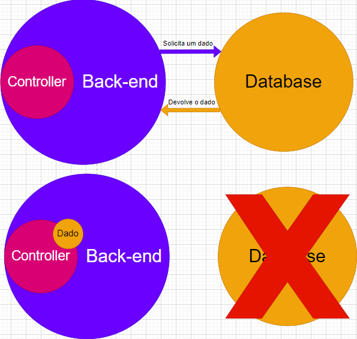

No nosso caso, criaremos os dados mockados simplesmente assim:
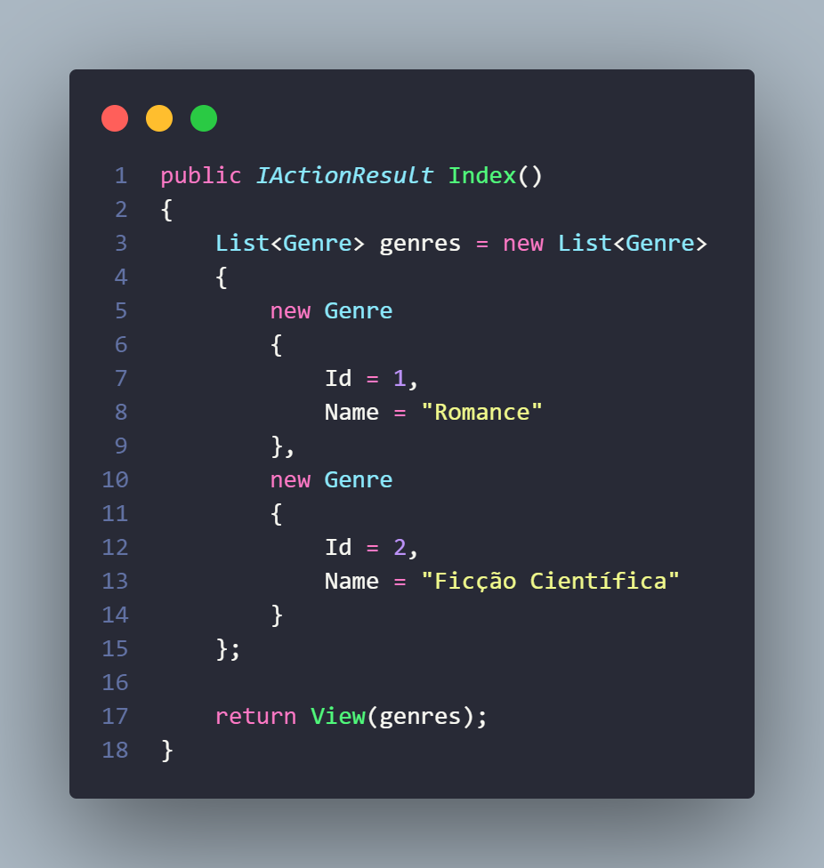

Basicamente instanciamos uma lista de gêneros (lembrem-se de importar a classe Genre) e adicionamos direto dois gêneros nela, notem que tanto para instanciar a lista quanto instanciar os objetos Genre a gente usou a estrutura de chaves ao invés do construtor com ( ), o que é perfeitamente possível.

Depois disso, algo interessante que fizemos foi passar essa lista como um parâmetro para o method builder `View()`, para que serve isso? Pois conseguimos buscar essa lista na nossa View e mandar ela ser exibida, falando em View, vamos criar ela.

# View
Como nosso Controller de Genres só tem a Action Index, que seria a Action para exibir os Genres, sem adicionar, remover, editar e nem nada, só precisamos criar por enquanto, a View correspondente a essa Action.

Como explicado anteriormente no tópico sobre As Várias Views, cada Controller tem uma pasta na pasta de Views e cada Action tem um arquivo `.cshtml`.
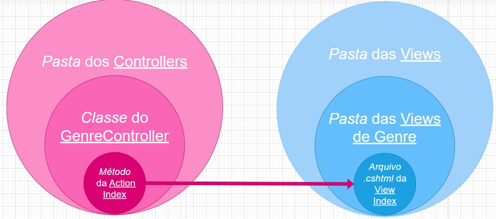

## Como criar uma View?
Assim como os controllers, até dá pra criar toda do zero, mas podemos facilitar um pouco as coisas, para isso, basta escolher adicionar uma view (ou Exibir, se você estiver com o Visual Studio em português) dentro da pasta Genres dentro da pasta Views (temos que criar essa pasta Genres).
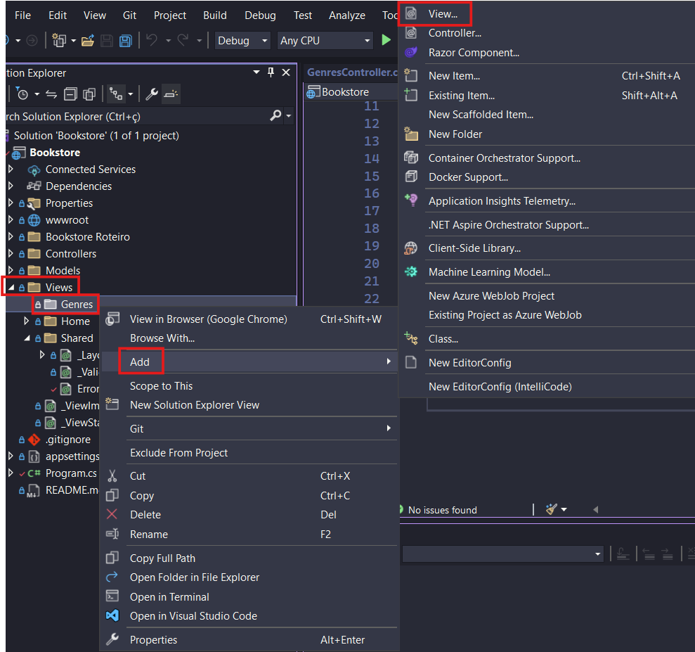

Selecione a opção **Exibicao Razor - Vazia** ou **Razor View - Empty**.
Note que ele também abre aquela tela clássica do `Ctrl + Shift + A`, agora só precisa dar o nome para a View, chamaremos ela de Index, que provavelmente é o nome que já apareceu como sujestão.

## Mexendo na View
Note como apareceu uma estrutura bem simples de dois blocos que usam `@`, o primeiro é um comentário (usa `@* *`) e o segundo é um bloco de código (usa `@{ }`), mas não temos HTML ainda, bom, vamos montar nossa base do HTML primeiro e depois focamos na parte dinâmica desse HTML (exibir os gêneros literários).

A base do nosso HTML será mais ou menos assim, um título, um link para adicionar novos gêneros e uma tabela que mostra os nomes de todos os gêneros:

Só que, como dá pra notar, tá faltando muita coisa, essa é a parte estática da nossa tela.
Vamos enumerar o que falta aqui:

1. Adicionar um título para a página que apareça na guia:

2. Interligar esse nome da guia com o `<h1>` que temos;
3. Importar aquela lista que enviamos pelos parâmetros do method builder;
4. Colocar a coluna "Nome" com um nome mais dinâmico;
5. Adicionar um caminho para o link de "Adicionar novo gênero";
6. Exibir os gêneros daquela lista de forma dinâmica;
7. Pra cada gênero exibido, já deixar prontos botões para excluir, editar ou visualizar.

Como dizia Jason, vamos por partes.

### 1 e 2 - Título na guia e na página
Para adicionar um título na guia do site precisamos usar o dicionário ViewData[] que vimos e dizer qual o valor da chave Title. Para adicionar o mesmo nome na página e garantir que o que aparece na guia aparece na página, podemos chamar o mesmo ViewData dentro do `<h1>`:
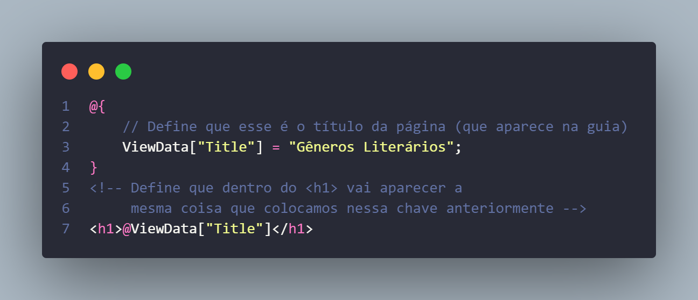

### 3 - Importar a lista
Aqui temos duas opções:
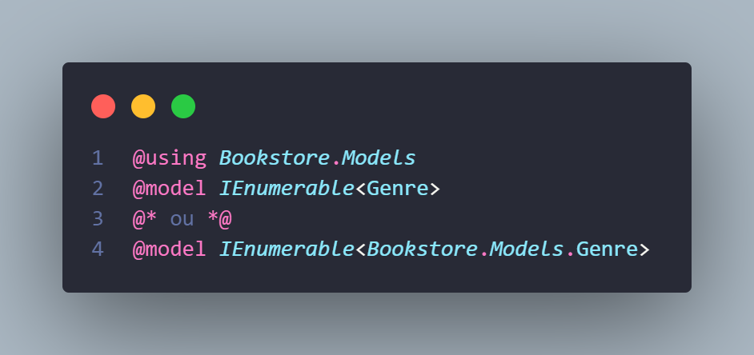

Em ambas fazemos o mesmo, o processo de dizer que usaremos a lista é através do `@model`, nele precisamos passar qual coleção usaremos, nesse caso passamos a mais genérica possível (IEnumerable) pois só vamos mandar imprimir os itens na tela. A questão é que é preciso dizer o tipo dos itens dessa coleção, para eu conseguir dizer que são do tipo Genre, preciso importar esse tipo no documento, para isso podemos importar a pasta separado no `@using` ou importar direto dentro dos <> com `<Bookstore.Models.Genre>`.

### 4 - Coluna Nome mais dinâmica
Nossa tabela tem uma tag `<th>` com a palavra Nome, ou seja o cabeçalho de uma coluna chamada Nome. Isso até é possível, mas tem uma forma mais exótica e completa de fazer isso, que é dizendo que nessa coluna deve aparecer o exato nome do atributo que a gente quer.

Exemplo: Queremos exibir gêneros nessa tabela, certo? Todo gênero tem um Id e um Name, podemos pedir para ele exibir exatamente o nome que o atributo tem, Name, basta fazer isso:
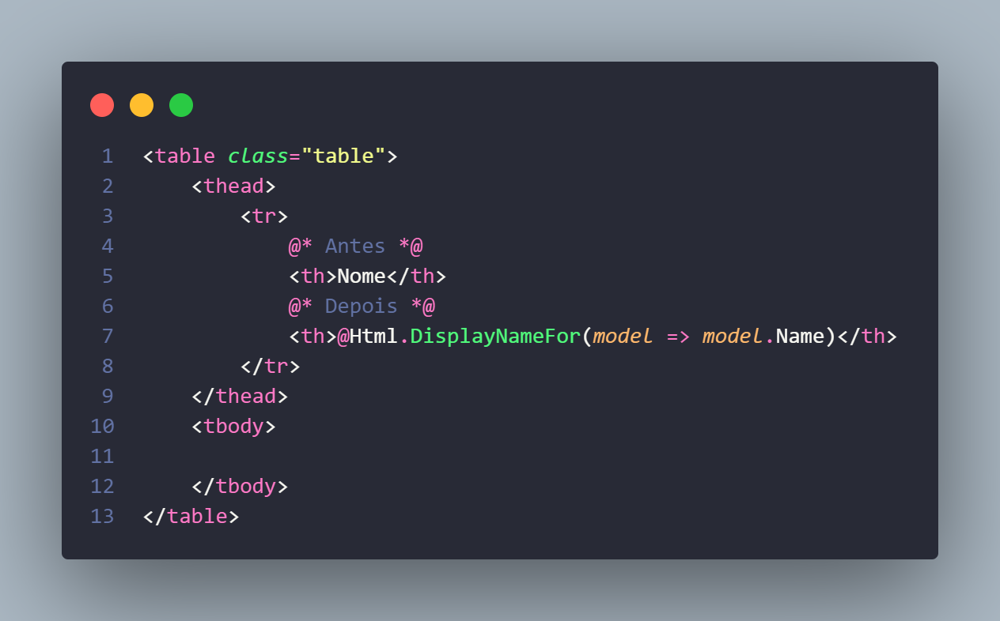

Parece meio desnecessariamente complicado, mas vocês vão ver que usaremos um negócio bem parecido pra exibir os dados, para manter um padrão no código e garantir que a gente vai vincular certinho a coluna com os dados que aparecem nela, vamos fazer isso aqui mesmo.

Além disso, olha só quem voltou, a nossa boa e velha **arrow function**, aqui nós vamos chamar ela de `expressão lambda`. No caso, esse método DisplayNameFor já é feito para percorrer aquele model que a gente importou no `@model`, que é a lista contendo os dados, no caso dizemos: "É pra exibir aqui o nome que tá especificado pro atributo do model chamado 'Name'", parece meio redundante.

Acontece que a gente tem usado alguns nomes em inglês pro código, isso porque vocês vão ver muito disso no mercado e por fins de facilitar a compreensão do framework e do intellisense, mas a parte do sistema visível ao usuário vai ser em português, logo, fazer o que fizemos ali seria ruim, pois agora a coluna exibe "Name" e queremos manter "Nome". Precisamos voltar a como era antes então? Não! Podemos manter esse código especial mas dizer que, por mais que o atributo se chame "Name", ele deve ser exibido na tela como "Nome", para isso precisamos voltar na model rapidinho:

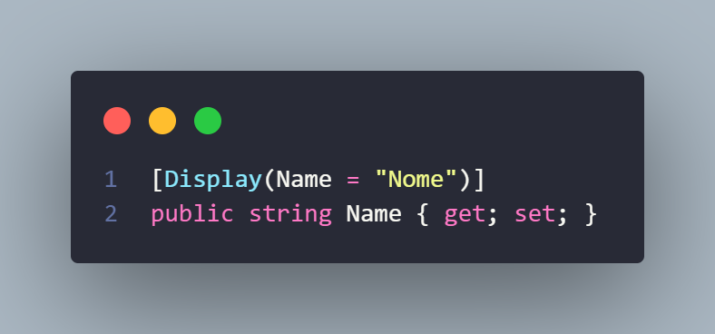

Isso que vocês estão vendo é uma anotação, é algo comum em frameworks back-end, no caso, estamos especificando algo sobre esse atributo Name, estamos especificando que o nome que deve ser exibido na verdade é "Nome", isso resolve nosso problema de tradução!

### 5 - Adicionar caminho pro Link
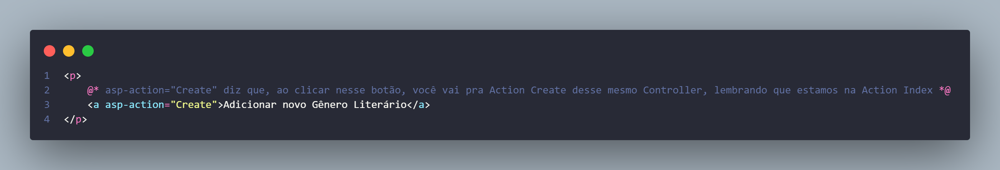
Como dá pra notar, é possível combinar tags HTML clássicas com atributos específicos do ASP.NET Core, nesse caso, usamos um link que leva não para uma URL específica, mas sim para a Action focada em criar novos Genres, que por sua vez vai carregar a View focada nisso também.

### 6 - Exibir os gêneros literários dinamicamente
Agora vamos para a parte principal, ter a possibilidade de exibir os dados que enviamos inicialmente lá do controller.
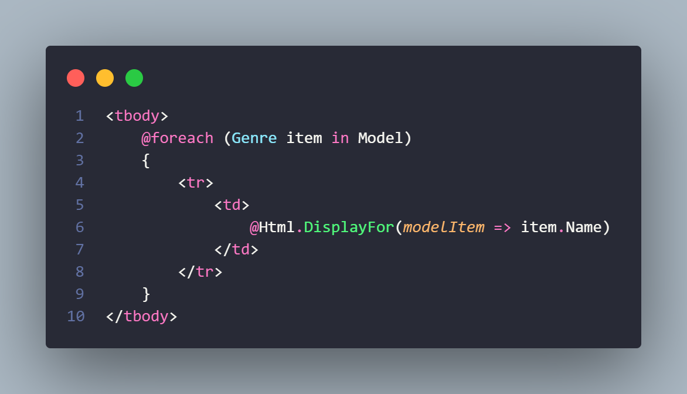
Talvez vocês tenham pensado que é algo complexo, mas na verdade não tanto, a gente simplesmente percorreu aquela lista usando um foreach e disse que para cada um, queremos imprimir uma linha da tabela `<tr>` com uma coluna `<td>` contendo o nome do gênero, agora, uma coisa importante de entender é o nome das variáveis auxiliares que estamos usando:
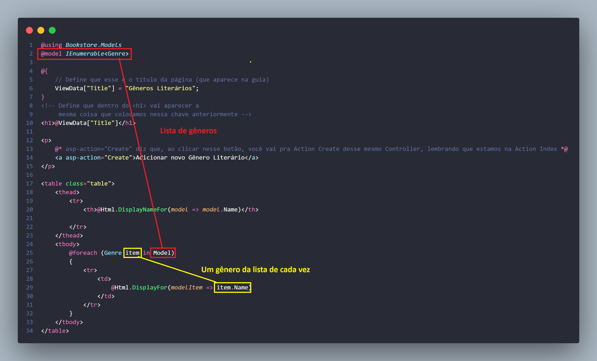

### 7 - Adicionando botões de visualizar, apagar e editar os dados
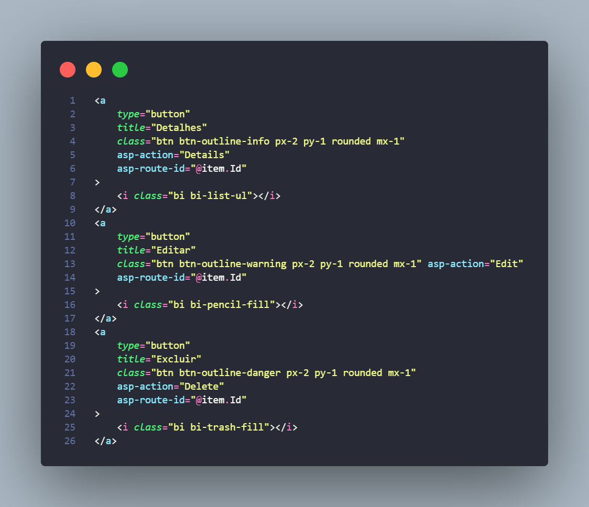

Vamos entender cada parte desse código:
* **asp-action:** Quando clicarmos nesse link, iremos para Action especifica de cada botão (Detalhes, editar e excluir).
* **asp-route-id:** Precisamos específicar nas três com qual Genre específico queremos fazer essa action, quem quero ver os detalhes, quem quero editar, quem quero apagar? Pra isso passo o Id do Genre específico, lembrando que estou dentro do foreach, então item é a variável que o foreach usa pra percorrer a lista de Genres.

Não vou explicar o Bootstrap de novo, já vimos bastante sobre isso.
