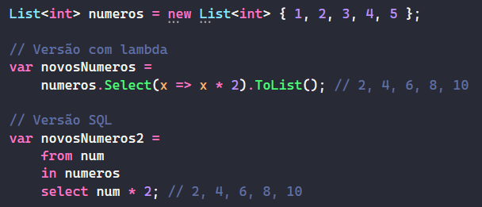
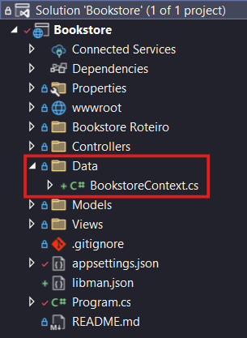
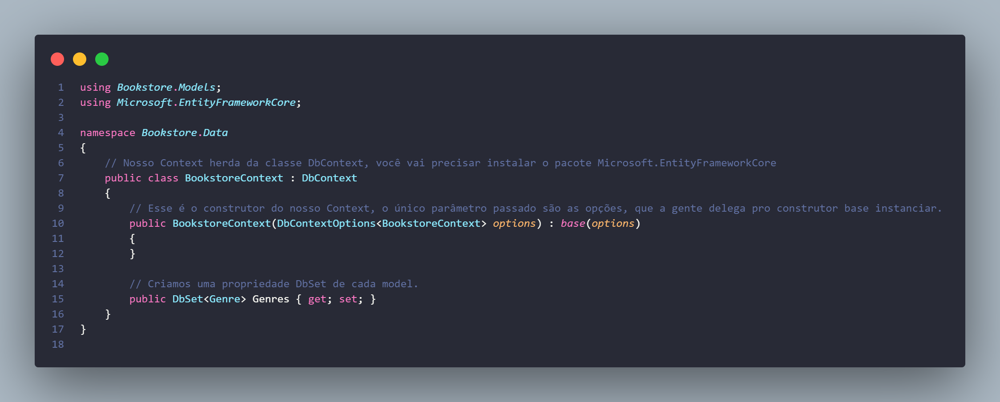
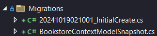

# Configurando Banco de Dados
Existem duas formas de prosseguir quando se trata de configurar o banco de dados de uma aplicação:

## Abordagem Database-first
Na abordagem database-first, o desenvolvedor começa com um banco de dados já existente, seja ele um banco legado ou um novo banco que foi projetado e implementado por um DBA. O ORM gera as classes de modelo automaticamente com base no esquema do banco de dados.

## Abordagem Code-first
Na abordagem code-first, o desenvolvedor cria as classes de modelo no código (backend) que representam as entidades do banco de dados e depois gerar automaticamente as entidades e tabelas do banco de dados. Essa abordagem é mais voltada para desenvolvedores que preferem começar a aplicação pela lógica de negócio e o código e deixar a estrutura do banco de dados ser gerada com base nesse código.

## ORM (Object Relational Mapping)
Estima-se que antigamente, 30% de todo o esforço de fazer uma aplicação vinha de fazer o sistema orientado a objetos se comunicar com as tabelas do banco de dados. Embora os dois paradigmas lembrem um ao outro, na prática não é tão simples, ou pelo menos não era, pois hoje existe o que chamamos de ORM (Object Relational Mapping, ou mapeamento objeto relacional), que são frameworks focados exclusivamente em fazer uma comunicação transparente entre as classes do código e as entidades do banco.

Cada linguagem tem seu próprio ORM, aqui vai alguns deles:
* ASP.NET Core:  _**Entity Framework Core**_
* Java Spring:   _**Hibernate**_
* Express.js:    _**Sequelize**_
* Django:        _**Django ORM**_
* Flask:         _**SQLAlchemy**_
* Laravel:       _**Eloquent**_
* Ruby on Rails: _**Active Record**_

Obviamente, usaremos o Entity Framework Core, ou EF Core.

## Como funciona o mapeamento objeto-relacional do EF Core

### Tópico 1 - Providers
O EF Core fornece o que chamamos de ***providers***, que são "comunicadores" com diferentes bancos de dados, ou seja, se vamos usar o MySQL, precisamos instalar o provider do EF Core para MySQL.

### Tópico 2 - DbContext
O **`DbContext`** é a classe principal do **Entity Framework Core (EF Core)** que representa a conexão com o banco de dados. Ele é responsável por gerenciar a comunicação entre a aplicação e o banco, como:
* fazer consultas
* salvar dados
* aplicar migrações.

O `DbContext` também rastreia as mudanças nas entidades, o que permite que o EF Core saiba o que precisa ser inserido, atualizado ou removido no banco de dados.

É como se fosse o "cérebro" que coordena todas as operações entre o código e o banco de dados.

### Tópico 3 - DbSet<<T>Entidade>
O **`DbSet`** é como uma **coleção** que representa uma **tabela específica** do banco de dados. Ele permite que você manipule os dados dessa tabela através de objetos (entidades). Com o `DbSet`, você pode fazer operações como:
* adicionar
* consultar
* atualizar ou
* remover registros daquela tabela.

Cada `DbSet` dentro de um DbContext corresponde a uma tabela no banco de dados, e os objetos que você manipula são as linhas dessa tabela.

Por exemplo, se você tem um `DbSet<Genre>` no seu DbContext, ele representa a tabela "Genre", e você pode usá-lo para interagir com os registros dessa tabela no banco de dados, como adicionar um novo gênero literário ou buscar os existentes.

### Tópico 4 - LINQ
LINQ ou Language Integrated Query (Consulta integrada de linguagem) é talvez a minha coisa favorita do C#. É muito comum em aplicações back-end que, para configurar a inserção dos objetos no banco ou então a busca deles, tenhamos que literalmente escrever dentro de uma string, a consulta SQL no banco de dados.

Lembram de quando fizemos o projeto do ViaCEP e tivemos que escrever isso:
```js
responseContainer.innerHTML += `
  <div class="div-${chave}">
    <h4 class="h5 title" id="${chave}-title">${listaExibicao[chave]}</h4>
    <p id="${chave}-content" class="text-light">${data[chave]}</p>
  </div>
`;
```
Depois que usamos o React e tinhamos o JSX, vimos como isso era ruim, no caso do LINQ, a coisa é similar, mas com consultas do banco de dados (na verdade o LINQ pode ser usado em outros contextos também, mas é mais usado junto do EF Core).
Olha só o que ele é capaz de fazer:

Olha como teriamos que fazer sem LINQ:
```c#
var sql = "SELECT num * 2 FROM numeros";
```
Isso, claro, num exemplo simplificado.

### Tópico 5 - Connection String
Para nos conectarmos com o banco de dados, precisamos escrever uma string de conexão no nosso arquivo de configuração `appsettings.json`, nela dizemos qual é o servidor, usuário, senha e banco de dados com quem queremos nos conectar, toda string tem essa estrutura:

```json
"ConnectionStrings": {
    "SeuDbContext": "server=seuServer;userid=seuUser;password=suaSenha;database=seuBanco"
}
```
### Tópico 6 - Configuração do builder da aplicação
A configuração e construção da aplicação é feita toda no Program.cs, lá a gente precisa adicionar um serviço correspondente à conexão com o banco de dados, mas vamos ver isso na parte prática.


# Mão na massa!
Agora que alinhamos alguns tópicos importantes, vamos pôr a mão na massa e escrever o código:

## DB Context
Criaremos uma pasta chamada `Data` na raíz do projeto e dentro dela criaremos uma classe chamada `BookstoreContext`.


O código dentro dessa classe será assim:


Note uma coisa importante, é preciso instalar a dependência do EntityFrameworkCore, para isso pode-se simplesmente clicar no DbContext e selecionar a opção de instalar esse pacote, pode-se procurar no manipulador de dependências do NuGet ou só digitar um comando `dotnet add package Microsoft.EntityFrameworkCore` no terminal na raiz do projeto, se isso parecer confuso, estamos fazendo a mesma coisa que faziamos quando escrevíamos `npm install` alguma coisa, só que agora no C#. 

A cada nova model que a gente criar, um novo DbSet a gente adiciona, pois isso representará uma nova tabela no banco de dados.

## Connection String
Agora precisamos ir no arquivo de configuração do projeto, o `appsettings.json` e configurar a string de conexão do nosso banco de dados.

No nosso caso, ficará assim:
```json
"ConnectionStrings": {
    "BookstoreContext": "server=localhost;userid=root;password=Senac2021;database=db_bookstore"
}
```
Isso vai abaixo do `"AllowedHosts": "*"`, coloque uma vírgula depois dele para parar o erro.

Lembrando que se você estiver lendo esse material fora do Senac, a string de conexão será diferente, aqui estão os dados para se conectar ao MySQL do senac, basta trocá-los pelos seus.

## Baixando Provider do MySQL
Precisamos baixar o "conector" do EF Core com o MySQL, o nome da depenência é `Pomelo.EntityFrameworkCore.MySql` e a forma de baixar é como citado antes para a outra dependência, pode ser na interface do Visual Studio, na linha de comando, você decide.

## Adicionando Serviço no Builder
Agora precisamos configurar a nossa aplicação para fazer a conexão em si, essa é a parte mais complexa em questão de entender o código.

Vamos para o `Program.cs`, o entrypoint da aplicação. Como vocês podem ver, ele já tem bastante coisa e iremos manter isso mesmo, mas precisamos entender onde iremos mexer no nosso código:
```c#
public class Program
{
    public static void Main(string[] args)
    {
        var builder = WebApplication.CreateBuilder(args);

        // Add services to the container.
        builder.Services.AddControllersWithViews();

        // >>>>> Mexeremos aqui <<<<<

        var app = builder.Build();
        ...
```

Por que isso? Precisamos entender o que tá rolando nessa classe.
```c#
public class Program
{
    public static void Main(string[] args)
    {
        // Aqui criamos o builder, o construtor da aplicação
        var builder = WebApplication.CreateBuilder(args);

        // Aqui adicionamos serviços a ele, ou seja, coisas que serão usadas na aplicação
        builder.Services.AddControllersWithViews();

        // >>>>> Mexeremos aqui <<<<<
        // No local marcado, podemos adicionar mais serviços necessários, 
        // como bancos de dados, autenticação, etc. Exemplo:
        // builder.Services.AddDbContext<MyDbContext>(options => 
        //    options.UseSqlServer("connection_string"));

        // Aqui a gente "builda" a aplicação, ou seja, construímos ela
        var app = builder.Build();

        // Configure the HTTP request pipeline.
        if (!app.Environment.IsDevelopment())
        {
            // Se a aplicação não estiver em ambiente de desenvolvimento, 
            // exibe uma página de erro personalizada em caso de exceções.
            app.UseExceptionHandler("/Home/Error");
            // Habilita o HSTS (HTTP Strict Transport Security) para proteger contra ataques man-in-the-middle.
            // A configuração padrão do HSTS é de 30 dias.
            app.UseHsts();
        }

        // Força a redireção de todas as requisições HTTP para HTTPS.
        app.UseHttpsRedirection();

        // Permite que a aplicação sirva arquivos estáticos (como imagens, CSS, JavaScript).
        app.UseStaticFiles();

        // Configura o roteamento de requisições HTTP para as actions nos controllers.
        app.UseRouting();

        // Habilita a autorização de usuários, necessário para funcionalidades de segurança.
        app.UseAuthorization();

        // Esse é o mapeamento de rotas do projeto, todas as rotas terão o formato:
        // /controller/action e talvez um /id no final.
        // Sendo que o controller padrão é o Home e a action padrão é a Index.
        app.MapControllerRoute(
            name: "default",
            pattern: "{controller=Home}/{action=Index}/{id?}");

        // Inicia a aplicação, começando a escutar as requisições HTTP.
        app.Run();
    }
}
```

Como nossa configuração do banco de dados é feita antes do build da aplicação, a gente tem que adicionar antes do comando `var App = builder.Build();`.

O comando para conectar com o banco de dados é esse:
```c#
builder.Services.AddDbContext<BookstoreContext>(options =>
{
    options.UseMySql(
        builder
            .Configuration
            .GetConnectionString("BookstoreContext"),
        ServerVersion
            .AutoDetect(
                builder
                    .Configuration
                    .GetConnectionString("BookstoreContext")
            )
    );
});
```

Vamos entender cada parte dele, lembra que na hora de criar o DbContext falamos que ele teria `options` como parâmetro pro construtor, então, esse código gigante são as options.

```c#
builder.Services.AddDbContext<BookstoreContext>(options =>
{
    // Configura o serviço DbContext que será usado para a interação com o banco de dados.
    // O DbContext é uma classe que representa uma sessão com o banco de dados e permite a 
    // execução de consultas e operações de CRUD.

    options.UseMySql(
        // Aqui, estamos dizendo ao DbContext para usar o MySQL como o provedor de banco de dados.
        builder
            .Configuration
            // O método `Configuration` acessa as configurações da aplicação.
            .GetConnectionString("BookstoreContext"),
            // Recupera a string de conexão com o banco de dados a partir do arquivo de configuração.
            // Neste caso, a string é identificada pelo nome "BookstoreContext".
        
        ServerVersion
            .AutoDetect(
                // O método `AutoDetect` automaticamente detecta a versão do servidor MySQL
                // para garantir que a aplicação se conecte corretamente à versão compatível.
                builder
                    .Configuration
                    // Novamente, acessa a configuração da aplicação.
                    .GetConnectionString("BookstoreContext")
                    // Obtém novamente a mesma string de conexão, que será usada para detectar a versão do MySQL.
            )
    );
});
```

## O que é uma Migration?
Uma migration é um script feito para gerar e versionar o nosso banco de dados. Toda vez que fazemos alguma alteração na modelagem do nosso projeto (nas entidades que compõem ele, os Models), geramos uma nova Migration, ou seja, uma nova versão do script que configura o banco de dados, em outras palavras.

## Iniciando a Primeira Migration!
Se a aplicação estiver rodando, pare ela fechando o terminal que foi aberto ao rodá-la. Depois pressione as teclas `CTRL + Shift + B` para buildar a aplicação. Quando rodamos a aplicação convencionalmente é feito o build e depois a execução da aplicação, ao apertar esse atalho citado, é feito apenas o build, essa é uma forma eficiente de conferirmos se tem erros detectáveis em tempo de compilação.

Para executar o comando de criar a Migration, precisamos abrir o terminal do Nuget, para isso siga esse caminho na barra de tarefas:

Ferramentas > Gerenciador de Pacotes do NuGet > Console do Gerenciador de Pacotes

Após abrir um terminal com um `PM>` no canto, dentro dele digite o comando `Add-Migration Initial`, o Initial é o nome dessa Migration, pode ser outro se você preferir.

Outro comando possível (se você estiver no VS Code é a única opção) é `dotnet tool install --global dotnet-ef` para instalar os comandos do Entity Framework no terminal e `dotnet ef migrations add Initial` sendo Initial o nome, ele cria assim também. 

Esse comando irá gerar uma pasta chamada Migrations, nessa Migrations haverá duas classes:



Uma é a classe contendo essa Migration e a outra é uma snapshot de como a base de dados está no momento, não mexemos em nenhuma delas.

## Salvando as alterações

No mesmo terminal que vocês executaram o primeiro comando, executem (no do PM), o comando `Update-Database`.

Se for no terminal tradicional, o comando é `dotnet ef database update`.

Se tudo der certo, o terminal irá exibir alguns comandos SQL sendo executados, são os comandos SQL de criação do banco e da tabela.

