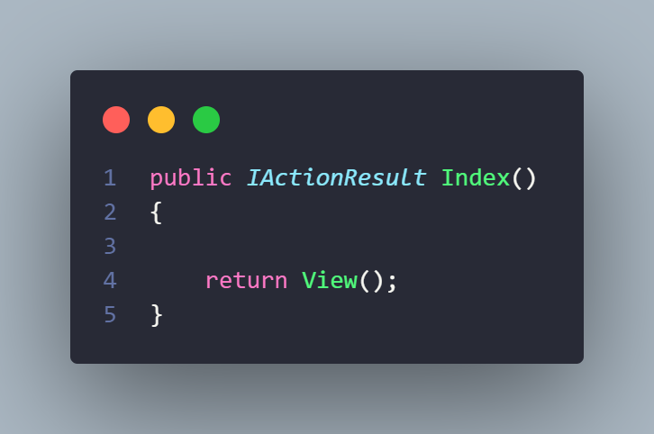
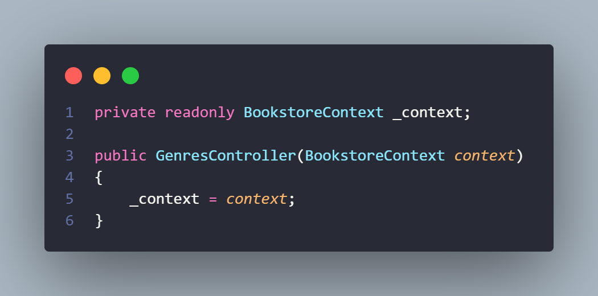
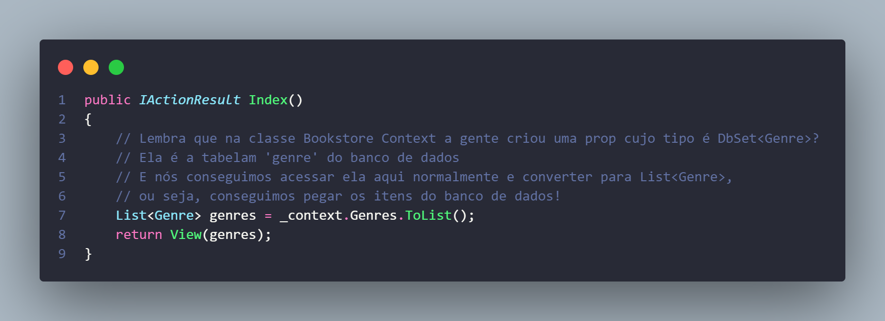
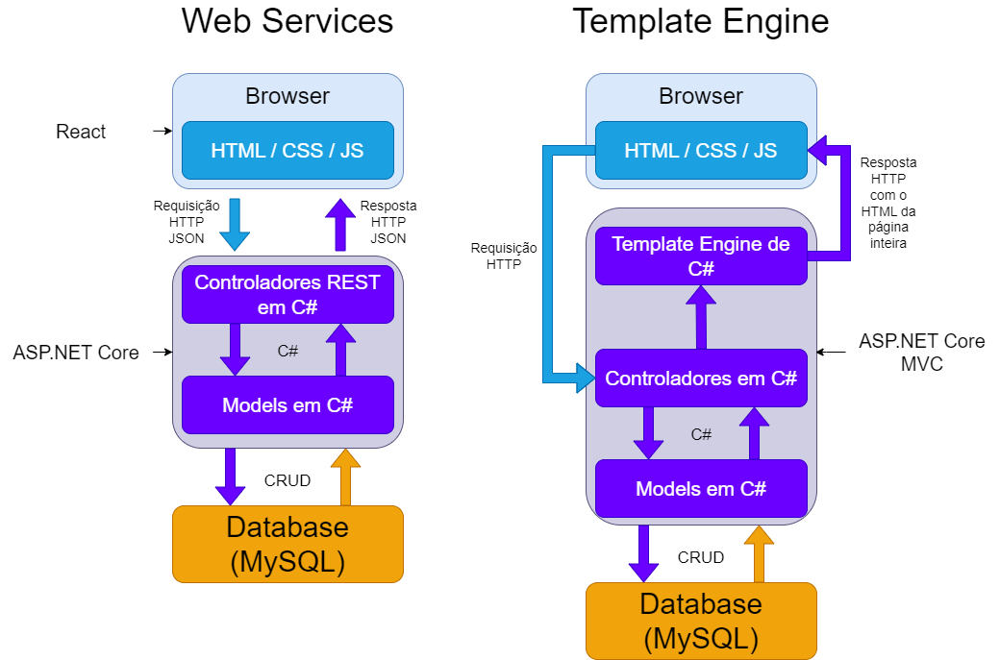
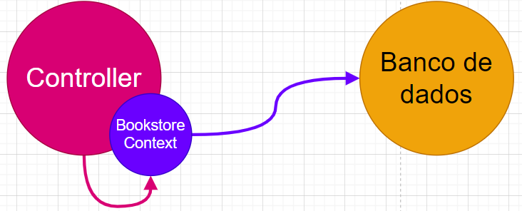
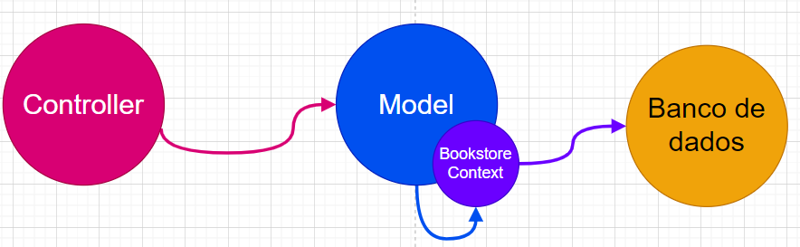
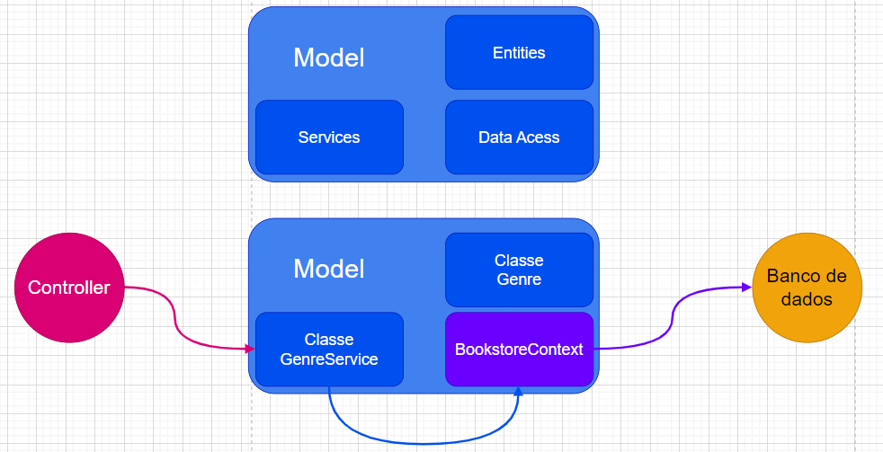
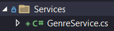
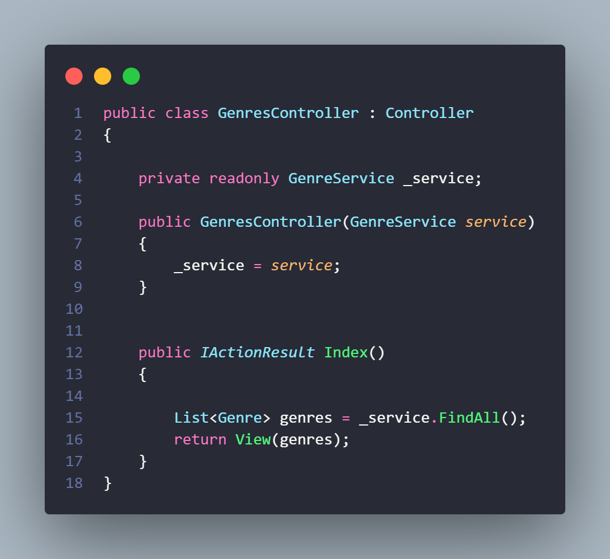

# Vinculando Genre com o Banco de Dados usando EF

## Conectando o Controller com o banco de dados

Agora que nosso banco de dados tem a tabela dos Genres, precisamos vincular nosso Controller a essa tabela, lembram que a gente tava testando a tela de listagem com uma lista de dados "mockados"?

Para resolver isso, vamos até o GenresController.

Aqui temos esse método:


A primeira coisa que vamos fazer é apagar a lista e o envio dela naqueles parênteses:



Agora precisamos nos conectar com o banco de dados, buscar todos os Genres e salvar numa lista.

A conexão com o banco de dados é feita através do BookstoreContext, nós precisamos criar um atributo cujo tipo é BookstoreContext, criar um construtor contendo esse atributo e usar esse atributo para fazer as buscas no banco de dados, vamos ver passo a passo.

### Criando atributo BookstoreContext e construtor


Note que o atributo é `private`, isso porque ele só será usado nessa classe e só deve ser acessado aqui.

Além disso ele é `readonly`, que significa que só podemos acrescentar um valor a ele através do construtor ou na declaração do atributo, depois não podemos mais, nem na mesma classe, lembra um pouco o `const` do JS, mas não é exatamente a mesma coisa.

Por ser `private`, o atributo tem que seguir a nomenclatura padrão de atributos privados, que é a camelCase com underline no começo, por isso `_context` e não `Context`.

### Usando essa instância do banco de dados para buscar os gêneros.
Agora que temos esse atributo que serve como uma instância do banco de dados no código, podemos nos conectar com o banco através dos métodos dele.

Para buscar todos os gêneros literários, vamos usar o seguinte código dentro do Index.


Viu como é simples? É a magia do Entity Framework, buscamos os dados da tabela de gêneros com um simples `_context.Genres.ToList();`.

Agora se você quiser testar, pode abrir o site no caminho `/Genres` e o MySQL, não vai aparecer nada na tabela de gêneros do site, mas se você inserir algo na tabela 'genres' do banco de dados vai aparecer no site (depois de atualizar).

Legal né? Tá funcionando, mas tem uma coisa que a gente precisa melhorar.

### Melhorar a divisão de tarefas

Na arquitetura MVC, as coisas tem que ser bem separadas para cada letra cuidar de algo, lembram daquela imagem onde eu explico Template Engines?



Ela se aplica à arquitetura MVC em geral, quem deve fazer a conexão com o banco de dados não é o Controller, ele serve unicamente como intermediário, mas no momento é ele quem está se conectando com o banco.


Ele não exibe as Views e nem busca os dados, ele é mais do tipo:

**"Chegou uma requisição pra ver os gêneros? Model, você busca no banco de dados e manda pra mim que eu mando o Razor carregar a página e mostrar eles".**

Talvez vocês pensem então: "Ok, precisamos ir na classe `Genre`, criar um método lá que faz a busca no banco e fazer o controller chamar esse método, certo?". Algo assim:


Mas a resposta correta é QUASE isso, na verdade, no modelo MVC, a gente pode ter uma subdivisão maior da letra M.


Na prática, como o controller não deve ser quem se conecta com o banco, criamos uma classe de serviço, essa classe de serviço serve para colocar essa lógica de negócio usada para buscar, salvar, editar e apagar itens no banco de dados, ela é quem vai fazer o CRUD com o banco e o controller só vai chamar ela.

Talvez vocês achem que isso é só mais trabalho atoa, mas a vantagem principal disso é a mesma da POO em geral, dividir ao máximo as tarefas para quem realmente foi feito pra fazer elas. Pois dessa forma, caso seja necessário mudar alguma regra de negócio, a gente muda só a model, sem precisar mexer no controller, se precisar mudar os caminhos da URL, a gente muda só o controller, se precisar mudar a estética mudamos só a view, então seguiremos nesse padrão.


Então vamos refatorar o código!
Primeiro vamos criar a classe do `GenreService`:



Dentro dessa classe a gente vai fazer o seguinte código:


Já o Controller vai ficar assim:



Pra finalizar, precisamos adicionar esse Service no sistema de injeção de dependências da aplicação, vamos ao `Program.cs` e, antes do código de build, adicionamos essa linha:

```c#
builder.Services.AddScoped<GenreService>();
```

### Injeção de dependência

Esse processo que fizemoa agora é o que chamamos de injeção de dependências (DI), ele é essencial no nosso sistema pois a partir daqui, delegamos todo o processo de instanciar um service e apagar ele para o nosso framework, se a gente n fizesse isso, teríamos que manipular o tempo de vida da instância do serviço manualmente, o que seria desnecessáriamente complexo e difícil.

Mas também não é só largar tudo na mão do framework e deixar ele se virar para descobrir quando criar e manter essa instância, a gente usou um método chamado `AddScoped<T>()`, esse método já específica o tipo de vida do objeto. Nesse caso, a gente tá dizendo que será feita uma instância do GenreService dentro do GenreController para cada requisição HTTP.

Agora já está funcionando novamente, se quiser pode testar cadastrar outro genre no banco e atualizar na página.

